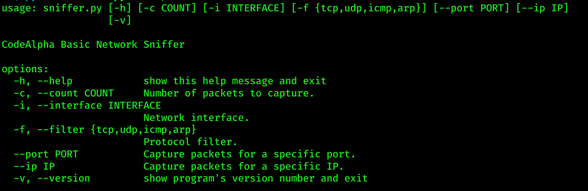
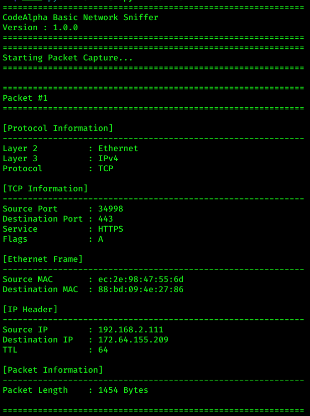
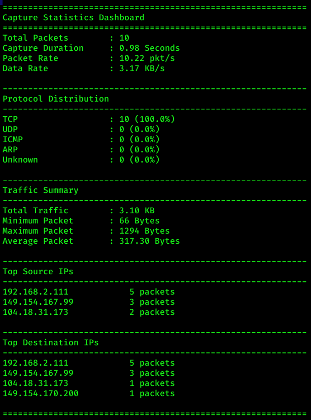
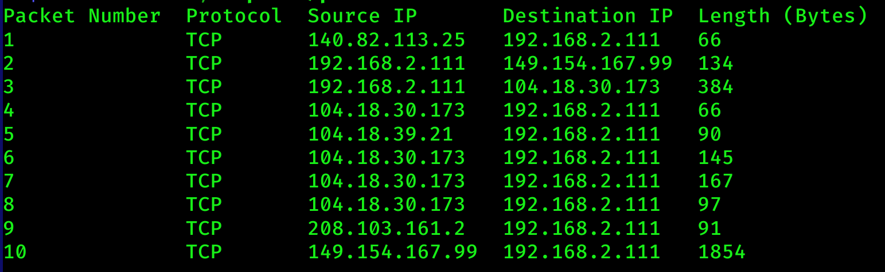
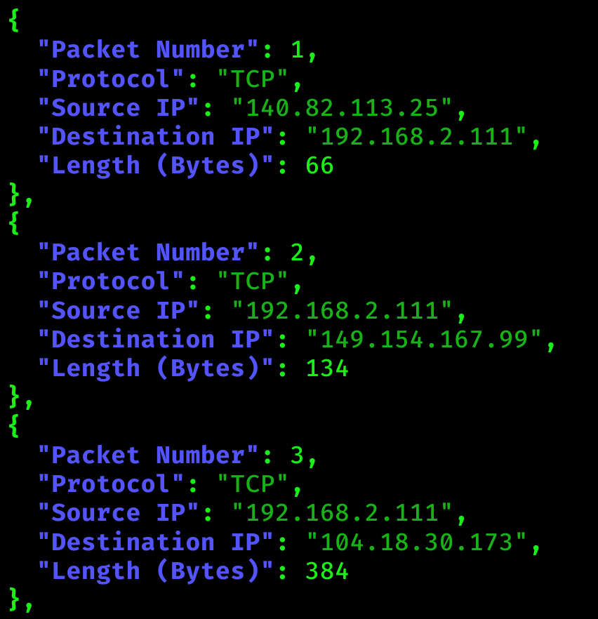
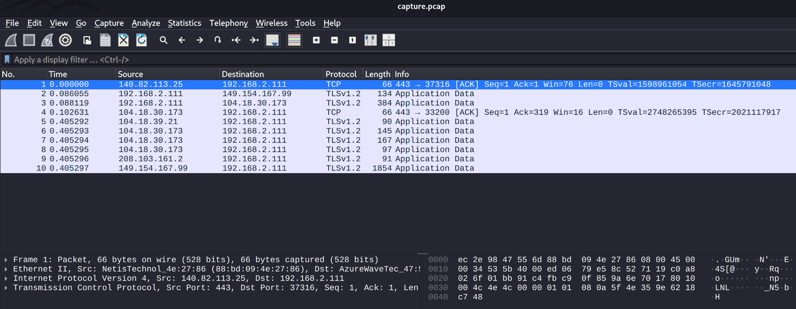
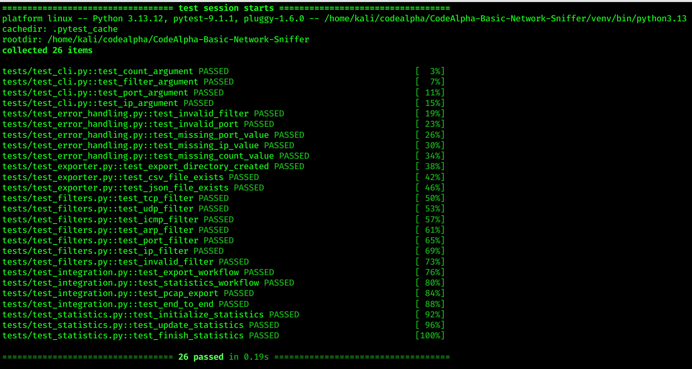
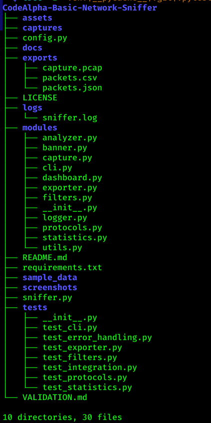

# 🛡️ CodeAlpha Basic Network Sniffer

<p align="center">


[](https://github.com/sahadatx/CodeAlpha-Basic-Network-Sniffer/actions/workflows/python.yml)


</p>

A professional Python-based **Network Packet Sniffer** built using **Scapy**.

This application captures live network traffic, analyzes packets, applies **Berkeley Packet Filters (BPF)**, exports captured packets in multiple formats (**CSV**, **JSON**, and **PCAP**), and provides a professional real-time statistics dashboard through a command-line interface.

Designed as part of the **CodeAlpha Cyber Security Internship**, this project demonstrates practical knowledge of packet analysis, network protocols, file exporting, software testing, and professional Python application development.

---


# 📑 Table of Contents

- [Features](#-features)
- [Screenshots](#-screenshots)
- [Project Structure](#-project-structure)
- [Requirements](#-requirements)
- [Installation](#-installation)
- [Quick Start](#-quick-start)
- [Usage](#-usage)
- [Statistics Dashboard](#-statistics-dashboard)
- [Export Formats](#-export-formats)
- [Testing](#-testing)
- [Logging](#-logging)
- [Technologies Used](#-technologies-used)
- [Future Improvements](#-future-improvements)
- [Contributing](#-contributing)
- [License](#-license)
- [Author](#-author)

---

# 🚀 Features

| Feature | Status |
|----------|:------:|
| Live Packet Capture | ✅ |
| Ethernet Analysis | ✅ |
| IPv4 Analysis | ✅ |
| TCP Detection | ✅ |
| UDP Detection | ✅ |
| ICMP Detection | ✅ |
| ARP Detection | ✅ |
| Berkeley Packet Filter (BPF) | ✅ |
| CSV Export | ✅ |
| JSON Export | ✅ |
| PCAP Export | ✅ |
| Wireshark Compatible | ✅ |
| Statistics Dashboard | ✅ |
| Logging System | ✅ |
| Error Handling | ✅ |
| Professional CLI | ✅ |
| Unit Testing | ✅ |
| Integration Testing | ✅ |

---

# 📸 Screenshots

## CLI Help



---

## Packet Capture



---

## Statistics Dashboard



---

## CSV Export



---

## JSON Export



---

## PCAP Export (Wireshark)



---

## Automated Testing



---

## Project Structure



---

# 📂 Project Structure

```text
CodeAlpha-Basic-Network-Sniffer/
│
├── .github/
│   └── workflows/
├── exports/
├── modules/
├── screenshots/
├── tests/
├── .gitignore
├── config.py
├── LICENSE
├── README.md
├── requirements.txt
├── sniffer.py
└── VALIDATION.md
```

# 📊 Statistics Dashboard

After each packet capture session, the application automatically generates a comprehensive statistics dashboard that summarizes the captured network traffic.

### Dashboard Overview

- Total Packets Captured
- Capture Duration
- Packet Rate (Packets/Second)
- Data Rate (KB/s or MB/s)
- Protocol Distribution
- Traffic Summary
- Top Source IP Addresses
- Top Destination IP Addresses

### Example Output

```text
============================================================
Capture Statistics Dashboard
============================================================

Total Packets      : 100
Capture Duration   : 10.25 Seconds
Packet Rate        : 9.75 pkt/s
Data Rate          : 22.93 KB/s

------------------------------------------------------------
Protocol Distribution
------------------------------------------------------------

TCP                : 75 (75.0%)
UDP                : 15 (15.0%)
ICMP               : 8 (8.0%)
ARP                : 2 (2.0%)
Unknown            : 0 (0.0%)

------------------------------------------------------------
Traffic Summary
------------------------------------------------------------

Total Traffic      : 2.75 MB
Minimum Packet     : 66 Bytes
Maximum Packet     : 1514 Bytes
Average Packet     : 462.75 Bytes

------------------------------------------------------------
Top Source IPs
------------------------------------------------------------

192.168.2.111      42 packets
8.8.8.8            15 packets

============================================================
```

---

# 📤 Export Formats

Captured packets are automatically exported into multiple formats for analysis and reporting.

| Format | Description |
|---------|-------------|
| CSV | Spreadsheet-compatible packet records |
| JSON | Structured packet data for automation |
| PCAP | Standard packet capture file compatible with Wireshark |

Generated Files

```text
exports/
├── packets.csv
├── packets.json
└── capture.pcap
```

### CSV Export

Each captured packet is stored in CSV format.

Example:

```csv
Packet Number,Protocol,Source IP,Destination IP,Length (Bytes)
1,TCP,192.168.2.111,149.154.167.99,134
2,TCP,192.168.2.111,104.18.30.173,382
```

---

### JSON Export

Packet information is also exported in JSON format.

Example:

```json
[
    {
        "Packet Number": 1,
        "Protocol": "TCP",
        "Source IP": "192.168.2.111",
        "Destination IP": "149.154.167.99",
        "Length (Bytes)": 134
    }
]
```

---

### PCAP Export

The application generates a standard **PCAP** file that can be opened directly using:

- Wireshark
- tcpdump
- Tshark
- Other packet analysis tools

---

# 🧪 Testing

The project includes automated **Unit Tests** and **Basic Integration Tests** using **Pytest**.

### Run All Tests

```bash
pytest tests -v
```

### Test Coverage

The test suite verifies:

- CLI Arguments
- Packet Filters
- Statistics Module
- Export Module
- Error Handling
- Integration Workflow

---

# 📝 Logging

Application events are automatically recorded for debugging and troubleshooting.

Log Location

```text
logs/
└── sniffer.log
```

Logged Information

- Application Startup
- Packet Capture Events
- Export Operations
- Statistics Generation
- Warning Messages
- Error Messages
- Unexpected Exceptions

---

# 🛠️ Technologies Used

| Technology | Purpose |
|------------|----------|
| Python | Programming Language |
| Scapy | Packet Capture & Analysis |
| argparse | Command-Line Interface |
| logging | Logging System |
| csv | CSV Export |
| json | JSON Export |
| Pytest | Automated Testing |
| Git | Version Control |
| GitHub | Source Code Hosting |
| Wireshark | PCAP Analysis |

---

# 🔮 Future Improvements

The following enhancements are planned for future releases:

- 🌐 IPv6 Packet Analysis
- 🌍 DNS Packet Analyzer
- 🌐 HTTP/HTTPS Header Parser
- 📊 Live Terminal Dashboard
- 🖥️ Graphical User Interface (GUI)
- 🔍 Packet Search & Filtering
- 🔁 Packet Replay Support
- ⚡ Multi-threaded Packet Capture
- ☁️ Cloud Log Export
- 📈 Advanced Network Traffic Visualization

---

# 🤝 Contributing

Contributions are welcome!

If you would like to improve this project:

1. Fork this repository.
2. Create a new feature branch.
3. Commit your changes.
4. Push your branch.
5. Open a Pull Request.

Please ensure that:

- Code follows PEP 8 style guidelines.
- New features include appropriate tests.
- Documentation is updated when necessary.

---

# 📄 License

This project is licensed under the **MIT License**.

You are free to use, modify, and distribute this software under the terms of the MIT License.

See the **LICENSE** file for more details.

---

# 👨‍💻 Author

**Sahadat Hossain**

Cybersecurity Enthusiast

- 📧 Email: pentester.sahadathossain@gmail.com
- 💼 LinkedIn: https://www.linkedin.com/in/pentester-sahadat-hossain/
- 🐙 GitHub: https://github.com/sahadatx


# 🙏 Acknowledgements

Special thanks to the following open-source projects and communities:

- Python
- Scapy
- Wireshark
- Pytest
- Git
- GitHub
- CodeAlpha Internship Program

---

# ⭐ Support

If you found this project useful:

⭐ Star this repository

🍴 Fork the project

🛠️ Contribute improvements

📢 Share it with others


---

<div align="center">

Made with ❤️ by **Sahadat Hossain**

⭐ If you found this project helpful, please consider starring the repository.

</div>